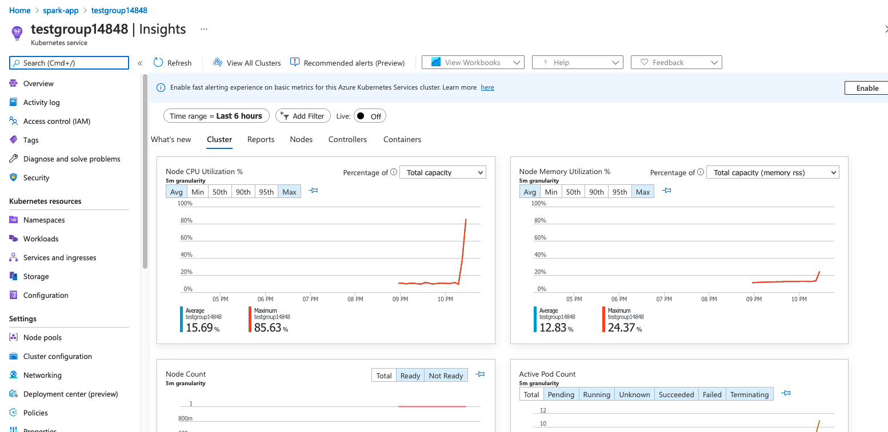
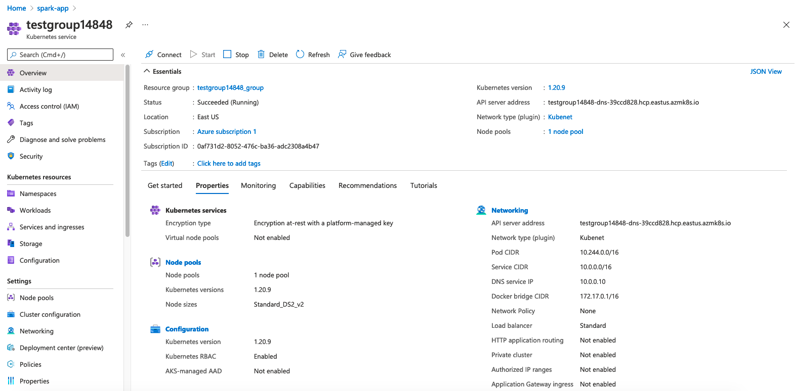
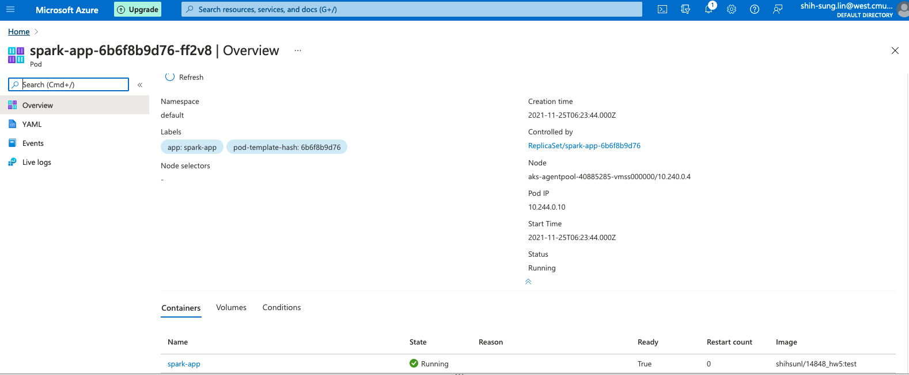
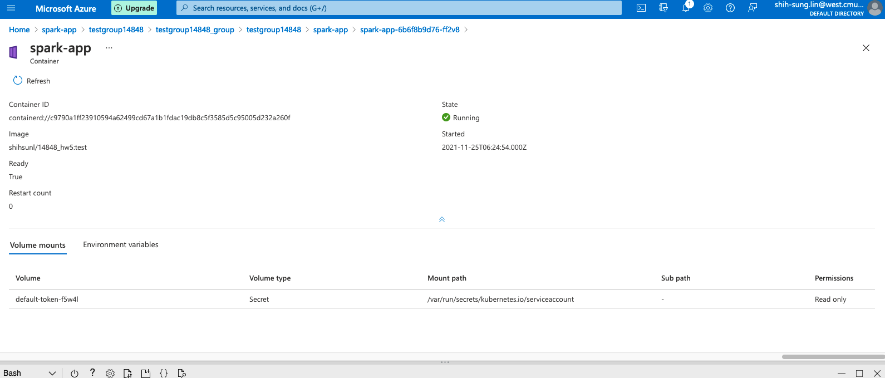
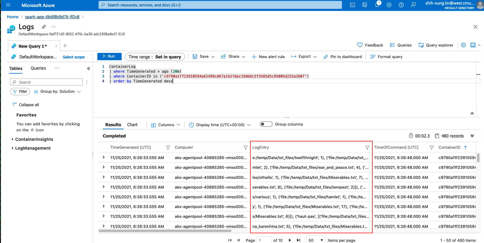

# Preparation
## Get docker image for running spark
- Please get the docker image from https://hub.docker.com/_/microsoft-mmlspark

## How to run docker container
```
docker run -v /path/to/14848_Cloud_Infra_A5:/temp --rm -it -p 8888:8888 -e ACCEPT_EULA=yes mcr.microsoft.com/mmlspark/release
```

# How to run spark?
## Run spark job
- Once you launch the docker container,
```
cd /temp
python3 spark_task.py
```

## Code
- I removed all the punctuation, '\r', '\n', and converted all characters to lower case.


## Output


# Azure Kubernates

## Create a cluster



## Create Workloads and Pods
- yaml file for creating workload
```
apiVersion: apps/v1
kind: Deployment
metadata:
  name: spark-app
  labels:
    app: spark-app
spec:
  selector:
     matchLabels:
       app: spark-app
  replicas: 2
  minReadySeconds: 15
  strategy:
    type: RollingUpdate
    rollingUpdate: 
      maxUnavailable: 1
      maxSurge: 1 
  template:
    metadata:
      labels:
        app: spark-app
    spec:
      containers:
        - image: shihsunl/14848_hw5:test
          imagePullPolicy: Always
          name: spark-app
          ports:
            - containerPort: 8888
            - containerPort: 8080
            - containerPort: 8042
```



## Azure container logs
