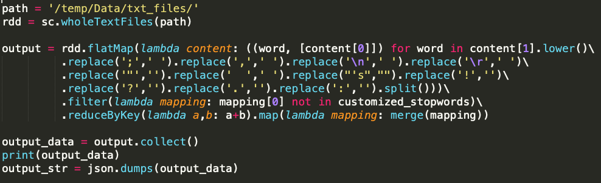
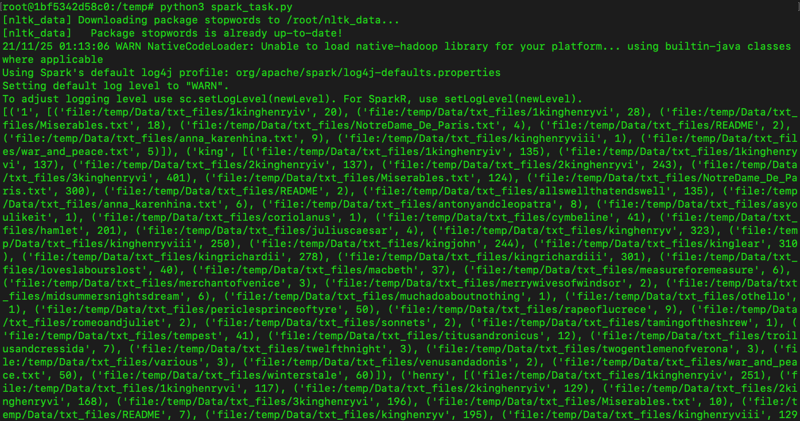

# Preparation
## Get docker image for running spark
- Please get the docker image from https://hub.docker.com/_/microsoft-mmlspark

## How to run docker container
- docker run -v /path/to/14848_Cloud_Infra_A5:/temp --rm -it -p 8888:8888 -e ACCEPT_EULA=yes mcr.microsoft.com/mmlspark/release

# How to run spark?
## Run spark job
- Once you launch the docker container,
```
cd /temp
python3 spark_task.py
```

## Code
- I removed all the punctuation, '\r', '\n', and converted all characters to lower case.


## Output


